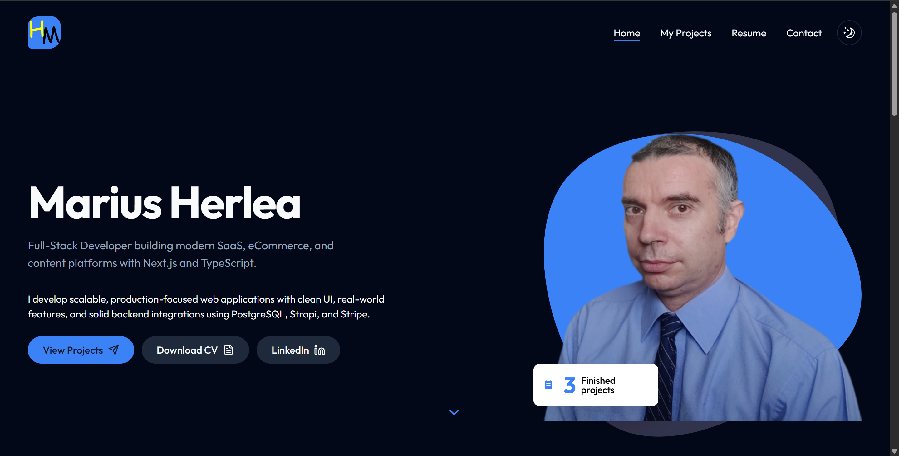
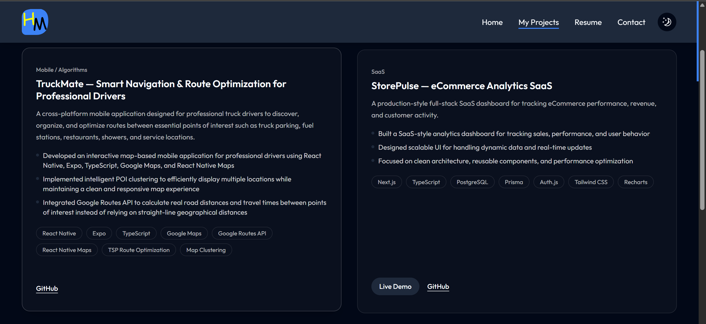

# Marius Herlea — Developer Portfolio

A modern personal portfolio showcasing full-stack projects built with Next.js, React, TypeScript, and practical backend integrations.

**Live website:** [mariusherlea.dev](https://www.mariusherlea.dev)



## About

I’m a Full-Stack Developer focused on building clean, responsive, production-oriented web applications.

This portfolio presents projects involving SaaS dashboards, eCommerce experiences, content platforms, payment integrations, mapping, and route optimization.

## Featured Projects

### TruckMate — Smart Navigation & Route Optimization

A cross-platform mobile application designed for professional truck drivers.

- Interactive map with parking, fuel stations, restaurants, showers, and service locations
- POI clustering for a clean map experience
- Real road distance and travel-time calculations with Google Routes API
- Multi-stop route optimization using a TSP-based approach
- Modular architecture with reusable components, hooks, services, utilities, and algorithms

**Built with:** React Native, Expo, TypeScript, Google Maps, React Native Maps, Google Routes API

[View source code](https://github.com/mariusherlea/poi-map-mobile-sdk53)

### StorePulse — eCommerce Analytics SaaS

A production-style analytics dashboard for tracking eCommerce performance, revenue, and customer activity.

- Dashboard-oriented UI for sales and performance data
- Reusable components and scalable frontend structure
- Designed for dynamic and real-time data workflows

**Built with:** Next.js, TypeScript, PostgreSQL, Prisma, Auth.js, Tailwind CSS, Recharts

[Live demo](https://candid-pie-22ddca.netlify.app/) · [View source code](https://github.com/mariusherlea/ecommerce-analytics-saas)

### Full-Stack eCommerce Platform

A modern eCommerce application with product pages, shopping cart, checkout flow, and Stripe payments.

**Built with:** Next.js, TypeScript, Strapi, Stripe, Tailwind CSS

[Live demo](https://ecommerce-frontend-otpz.vercel.app/) · [View source code](https://github.com/mariusherlea/ecommerce-frontend)

### Blog Platform with SEO & CMS

A content-driven blog platform with dynamic routing, comments, pagination, and CMS integration.

**Built with:** Next.js, TypeScript, Strapi, REST API

[View source code](https://github.com/mariusherlea/my-blog-frontend)



## Tech Stack

- Next.js
- React
- TypeScript
- Tailwind CSS
- Framer Motion
- Radix UI
- React Hook Form
- Formspree

## Features

- Responsive layout for desktop and mobile
- Light and dark theme support
- Animated page transitions and UI elements
- Project filtering and carousel
- SEO metadata, Open Graph tags, sitemap, and canonical URL
- Contact form integration

## Run Locally

```bash
git clone https://github.com/mariusherlea/marius-portfolio.git
cd marius-portfolio
npm install
npm run dev
```

Open [http://localhost:3000](http://localhost:3000) in your browser.

## Contact

- Website: [mariusherlea.dev](https://www.mariusherlea.dev)
- LinkedIn: [linkedin.com/in/mariusherlea](https://www.linkedin.com/in/mariusherlea/)
- Email: [contact@mariusherlea.dev](mailto:contact@mariusherlea.dev)

---

Built and maintained by Marius Herlea.